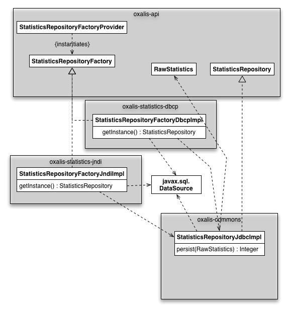

# Oxalis developer notes

The purpose of this document is to document how to develop and maintain the Oxalis code base

## The Oxalis home directory and configuration

The concept of an "Oxalis home area", was introduced in version 2.0 in order to provide the users of Oxalis with these benefits:

* Maintaining your configuration when installing new releases.
* Several versions of Oxalis may be installed concurrently

The Oxalis home directory is located in the following order:

1. Using the environment variable `OXALIS_HOME`
1. The directory `.oxalis`, located relative to the users home directory. The users home directory is determined by
  inspecting the Java system property `user.home`

### Sample configuration file

There is a sample configuration file located in `oxalis-commons/src/main/resources/oxalis-global.properties`.
You should copy this file to your `OXALIS_HOME` directory and modify it to your likings.

## Unit testing, integration testing etc.

Testing is performed using the TestNG framework.

In order to ensure that Oxalis will compile on machines which have not been prepared with JDBC drivers, configuration files
etc., the various tests involving databases, internet connections etc. (integration tests), have been marked as part of the
test group `integration`

    @Test(groups = {"integration"})

Furthermore, all such integration tests are excluded from the default maven test execution, which is peformed with the
surefire plugin:

    <plugin>
        <groupId>org.apache.maven.plugins</groupId>
        <artifactId>maven-surefire-plugin</artifactId>
        <configuration>
            <excludedGroups>integration</excludedGroups> <!-- Excludes integration tests -->
        </configuration>
    </plugin>

As a consequence, only the fast running unit tests will run when Oxalis is built using this command:
    mvn clean install

### Executing integration tests

In order to run the integration tests from the command line:
    mvn -P it-test clean install

In the `pom.xml` files, this is achieved by including the following declaration in a profile named *it-test*:

            <profile>
                <!-- Used for integration testing -->
                <id>it-test</id>
                <build>
                    <plugins>
                        <plugin>
                            <groupId>org.apache.maven.plugins</groupId>
                            <artifactId>maven-surefire-plugin</artifactId>
                        </plugin>
                    </plugins>
                </build>
            </profile>

Have a look at `oxalis-collector/pom.xml` to see further details.

As of current (April 5, 2013), this configuration has not been implemented in all modules

## DataSource and StatisticsRepository

All operations related to persistence of statistics are performed by an implementation of `StatisticsRepository`. There is only
a single implementation supplied with Oxalis, namely `StatisticsRepositoryJdbcImpl`. If you wish to use a different type of repository,
you should roll your own implementation and make it available using the *META-INF/services* idiom

However; since this class is used in standalone and JEE environments, it must be initialized with a `javax.sql.DataSource`,
which may be obtained either via JNDI or manual creation. Oxalis comes with two DataSource implementations:

1. `oxalis-jdbc-dbcp` - will instantiate a JDBC-driver according to the properties in `OXALIS_HOME/oxalis-global.properties` and
wrap that DataSource with Apache DBCP.
1. `oxalis-jdbc-jndi` - which will simply attempt to obtain a datasource from `java:/comp/env/+<whatever_you_defined_in_oxalis-global.properties>`

In order to make this totally transparent to the calling application, the following pattern should be used:

    // Locates an implementation of StatisticsRepositoryFactory using META-INF/services pattern
    StatisticsRepostiory repository = StatisticsRepostioryFactoryProvider.getInstance().getInstance();

I.e. when packaing your application, assuming you are using the supplied SQL based repository,
simply choose either `oxalis-jdbc-dbcp` or `oxalis-jdbc-jndi` and everything
should work fine.

Obsolete figure as per April 19, 2013 - will be replaced.

